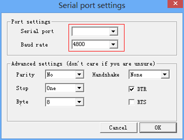
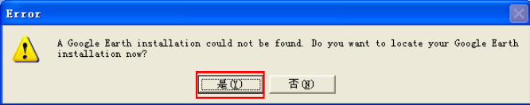
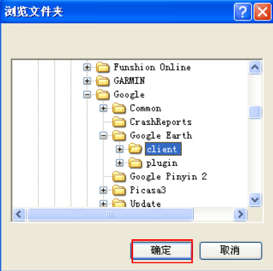
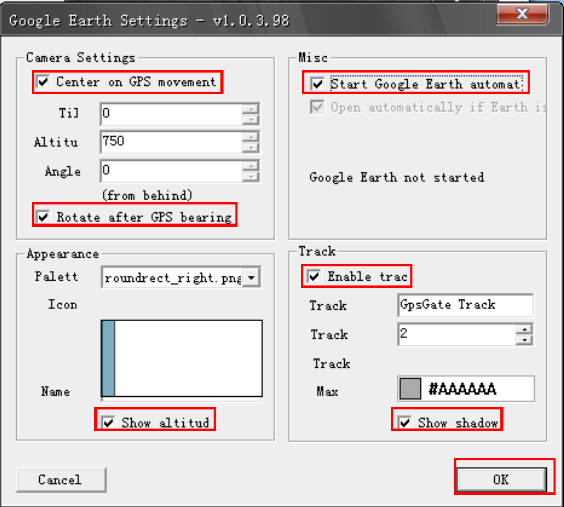

在做GPS模块测试开发时，模块可以通过串口线连接到电脑，将坐标信息在坐标软件显示出来，这些坐标软件中只能将坐标信息已点的形式显示到卫星图上，不能转化为我们可以看到的地图信息，如果想在地图上显示具体的坐标点，很容易想到的是通过自己写软件接收串口信息，同时通过地图提供的api将信息显示到地图上，但如果我不想写代码，只想通过简单的工具看到地图位置，有没有什么简便的方法呢？这个，当然是有的，需要借助强大的Google Earth， 还有他的一个插件GPS GATE。 插件可以接收串口的坐标数据，将数据转化为地图显示的标准格式的数据， 直接将数据输出但谷歌地图上， 这样就可以直接通过串口显示模块在地图的位置了。具体方法参考如下

需要用到的软件有两个：  
1.GPS gate ，下载地址：[gpsgate](http://gpsgate.com/products/gpsgate_client)  
2.Google Earth ，下载地址: [Google Earth](http://www.google.com/earth/)

下载完成后安装好，需要先设置好 GPS GATE,保证能够接收到GPS模块的地位信息，GPS的定位模块就不管了，反正必须要能定位，最好是通过坐标软件先测试能收到位置信息。设置方法如下： 
 
1.打开进入*Input*的*Settings*进行设置，需要设置的信息有GPSM模块接入端口和波特率。设置好确定即可。如图所示   

2.设置好需要点击 *setting*上面的*open*，如果收到GPS定位信息则会变成绿色; 
 
3.点击 *Output* 在 *Add output* 下拉列表中选择*GOOGLE EARTH* ,同时需要设置google earth的端口 ，点击下拉框下的*Add*进行设置   

4.点击 *Add*，如果是第一次使用可能会出现以下窗口，点击 *是*，查找安装路径即可。 步骤如下图所示 ；
 
5.上面设置好了GPS GATE, 下面需要设置Google Earth了。需要在设置中做如下的配置  
 
6.设置好后，在Google Earth中，*Realrime GPS* 和 *临时位置* 下的 *GPSGate* 能够实时显示当前位置。如果设置完成会在Google Earth地图上看到一个带着*I am here*文字的位置，这就是GPS模块获取的当前位置。  

至此，完成了显示位置的工作了。